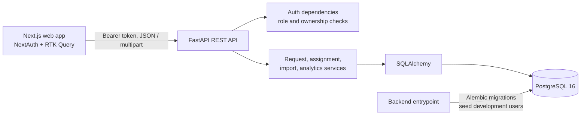

# Dataset Request Desk

## 1. Project Overview

Dataset Request Desk is an internal web application for managing robotics dataset requests. Clients create requests for a task and episode count; operators import episode metadata, assign eligible episodes, and deliver completed requests; clients then accept or reject deliveries. It replaces the spreadsheet-based request and assignment workflow with server-enforced permissions, validation, and status history.

The application uses Next.js 15, React 19, TypeScript, NextAuth, and Redux Toolkit Query in the frontend. The backend is a FastAPI application using SQLAlchemy, Alembic, and PostgreSQL 16. Docker Compose starts the frontend, API, and database together.

| Role | Capabilities |
| --- | --- |
| Client | Create requests, see only their own requests, and accept or reject deliveries. |
| Operator | View and process all requests, assign episodes, and import episode CSVs. |
| Admin | Operator capabilities plus user and role management and analytics. |

## 2. Prerequisites

For the documented one-command application startup, install Git and Docker with Docker Compose v2. Docker Desktop is suitable on Windows and macOS; Docker Engine and the Compose plugin work on Linux. The Dockerfiles use Node.js 20 and Python 3.12, so those runtimes do not need to be installed on the host to run the app.

Python 3.12 is required on the host to run the backend test suite. Node.js 20 and npm are required only for running the frontend directly on the host.

Check installed versions:

```bash
git --version
docker --version
docker compose version
python --version
node --version
npm --version
```

## 3. Quick Start

The repository URL was not included in the supplied project directory. Replace `<repository-url>` with the URL provided for the submission:

```bash
git clone <repository-url> dataset-request-desk
cd dataset-request-desk
cp .env.example .env
```

On Windows PowerShell, use `Copy-Item .env.example .env` instead of `cp`.

Edit `.env` before starting. Replace `POSTGRES_PASSWORD`, `JWT_SECRET_KEY`, and `NEXTAUTH_SECRET` with long random values. Keep the database password URL-safe (letters, digits, `_`, and `-`) because Compose builds the PostgreSQL connection URL from it. `.env` is ignored by Git; never commit secrets. The values in `.env.example` are local-development placeholders, not production secrets.

Build and start the full stack in the background:

```bash
docker compose up --build -d
docker compose ps
```

Follow startup progress in this terminal. When the services report ready, use a second terminal to continue:

```bash
docker compose logs -f db backend frontend
```

The first run builds images and installs dependencies, so it takes longer than later starts. Open the app after Compose reports the frontend ready:

| Service | URL |
| --- | --- |
| Frontend | <http://localhost:3000> |
| Backend API | <http://localhost:8000> |
| Interactive API documentation | <http://localhost:8000/docs> |
| OpenAPI schema | <http://localhost:8000/openapi.json> |
| Database-aware health check | <http://localhost:8000/health> |
| PostgreSQL from the host | `localhost:5432` |

The Docker Compose service names are `db`, `backend`, and `frontend`.

## 4. First-Time Database Setup

Compose starts PostgreSQL 16 and waits for its `pg_isready` health check. The backend then runs `alembic -c backend/alembic.ini upgrade head`, followed by `python backend/seed_users.py`, before starting Uvicorn on port 8000. The migrations create the user, request, status-history, episode, and assignment tables and their constraints and indexes.

`seed_users.py` reads `seed/users.json`. It creates missing users and hashes their passwords with Argon2. When a user with the same email already exists, the seed step updates the name and organisation but deliberately leaves the existing password unchanged. The `postgres_data` volume preserves the database across normal restarts.

Episode data is **not** loaded automatically. After startup, sign in as an operator or admin and upload `seed/episodes.csv` from the relevant **Import Episodes** page. This makes task names available to the client request form and gives the operator episodes to assign. The importer is safe to run more than once.

## 5. Test Credentials

These development accounts are read from `seed/users.json` and created by the backend startup step:

| Role | Email | Password | Purpose |
| --- | --- | --- | --- |
| Admin | `admin@example.com` | `admin123` | User management, imports, requests, assignments, analytics |
| Operator | `ops1@example.com` | `ops123` | Requests, episode imports, and assignments |
| Operator | `ops2@example.com` | `ops123` | Second operator account |
| Client | `client-a@example.com` | `client123` | Acme Robotics requests and delivery review |
| Client | `client-b@example.com` | `client123` | Beta Labs requests and delivery review |

These passwords are for local evaluation only. Do not use them in a deployed environment. If a database volume already contains one of these emails, its password is not reset by seeding; see [Troubleshooting](#15-troubleshooting).

## 6. Evaluator Walkthrough

### Start and import episodes

1. Start the stack using [Quick Start](#3-quick-start), then open <http://localhost:3000>.
2. Sign in as `admin@example.com` with the development password above. The Admin Dashboard should load.
3. Open **Import Episodes** in the admin sidebar. Choose `seed/episodes.csv` and click **Start Import**. The summary reports processed rows, imported episodes, database duplicates, in-file duplicates, and invalid rows. Open **View Details** to inspect row-level validation results.
4. Open **Episodes** and confirm imported episode IDs, tasks, robots, and qualities are listed.
5. Use **Logout** in the sidebar and choose **Log out** in the confirmation dialog.

### Create a request as a client

6. Sign in as `client-a@example.com`.
7. Open **Create Request**. The **Task Name** searchable combobox is loaded from distinct task names in imported episode data. Select `pick cup` (or another task with enough good/usable episodes), enter `5` episodes and a future deadline, and submit.
8. On **My Requests**, verify the request appears as **Submitted** with the selected task and requested count.
9. Log out using the confirmation dialog.

### Assign episodes and deliver as an operator

10. Sign in as `ops1@example.com` and open **Requests**. Open the client request and verify its task and required episode count.
11. Move it to **In Progress** and save the status.
12. Choose **Assign Episodes** for that request. The request task is prefilled in the task filter. Click **Apply** to run the filter. Matching ignores case and whitespace; only unassigned `good` or `usable` episodes are shown as eligible. Select five and assign them.
13. Try delivering before enough episodes are assigned (or use a separate request for this check). The API rejects delivery with a conflict and leaves the request in its current status. Once the assigned count meets the requested count, change the status to **Delivered** and save.
14. Log out using the confirmation dialog, sign in as `client-a@example.com`, and open **My Requests**. Open the request details and verify the timeline shows the persisted status changes and their recorded timestamps, alongside the assignment count.

### Review delivery and analytics

15. From the delivered request, choose **Accept Delivery** or **Reject Delivery**; rejection requires a reason. Confirm the request status and timeline reflect the decision. An accepted request is complete; a rejected request can be returned to **In Progress** by an operator for rework.
16. Sign out, sign in as admin, and open **Analytics**. Select a date range covering the seed recordings (August–September 2026) and click **Apply**. The page displays episodes per day, request counts by status, median submitted-to-delivered time when deliveries exist, and top good episode tasks.

## 7. CSV Import Behavior

The provided import file is [`seed/episodes.csv`](seed/episodes.csv). Its required columns are:

```csv
episode_id,robot_id,task_name,recorded_at,duration_seconds,operator_name,quality
```

Upload the CSV through **Admin → Import Episodes** or **Operator → Import Episodes**. The API accepts a multipart field named `file`. Files are limited to 25 MB. Headers are matched after trimming and normalizing spaces/hyphens to underscores; all seven columns are required.

Import validation and normalization:

- Required values must be non-empty. Episode IDs are trimmed and uppercased; robot IDs are trimmed and lowercased; task names are trimmed and case-folded; quality values are lowercased.
- Robot IDs must be one of `arm-01`, `arm-02`, `arm-03`, `mobile-01`, or `humanoid-01`. Quality must be `good`, `usable`, or `bad`.
- Duration must be greater than zero and at most 3,600 seconds. Decimal values are rounded half up to an integer second.
- `recorded_at` accepts ISO 8601 (including `Z`) and day-first `DD/MM/YYYY HH:MM[:SS]` timestamps. A timestamp without a timezone is treated as UTC. Future recordings are rejected.
- Invalid rows are skipped and reported with row number, episode ID when available, and reason. The report retains up to 1,000 error details; CSV schema/header failures reject the upload.
- Within one upload, the first valid occurrence of an episode ID wins. Later occurrences are reported as `duplicate_episode_id_in_file`.
- An ID already stored in the database is reported as `duplicate_episode_id`. This is separate from a duplicate in the current file.

To verify idempotency, upload the same `seed/episodes.csv` twice. The first import inserts valid, previously unseen IDs. The second import should insert **zero** episodes and report existing IDs as `duplicate_episode_id`; the episode count in **Episodes** remains unchanged. `backend/tests/test_import.py` includes the same-file idempotency check.

The optional [`seed/generate_episodes.py`](seed/generate_episodes.py) creates a clean synthetic CSV for volume checks. From the repository root, for example:

```bash
python seed/generate_episodes.py 200000 > episodes_large.csv
```

This is optional. It is not part of startup, and its generated file should not be committed.

## 8. Business Rules

- Every feature API route except login requires authentication. The health check and informational `/` API root are public. Role checks run in the backend, not only in the UI. Clients can read only their own requests.
- Only clients create requests. New requests start as `submitted`; their initial status is recorded in status history.
- Operator/admin transitions are `submitted → in_progress → delivered`. A rejected request can return to `in_progress` for rework. Clients can transition their own delivered requests to `accepted` or `rejected`; rejection requires a reason. Accepted is terminal.
- A request cannot be delivered until its assignment count is at least `episodes_requested`.
- Only `good` and `usable` episodes can be assigned. An episode can have at most one assignment at a time; a database uniqueness constraint and service checks enforce this. Assignments can be removed before delivery/acceptance, but removal is blocked after delivery or acceptance.
- Assignments are allowed for operational requests in `submitted`, `in_progress`, or `rejected` state. Invalid states, missing episodes, bad-quality episodes, duplicate IDs in a batch, and already-assigned episodes are rejected.
- Every request status transition is stored with its actor and timestamp. Admins can perform operator transitions, but client accept/reject decisions are reserved for the owning client.
- User administration is admin-only. The last active admin cannot be deactivated or demoted.

## 9. API Documentation

Interactive OpenAPI docs are available at <http://localhost:8000/docs>. Protected endpoints expect `Authorization: Bearer <access_token>` from `POST /api/auth/login`.

| Feature | Method and URL | Authentication / role | Description |
| --- | --- | --- | --- |
| Health | `GET /health` | Public | Checks database connectivity; returns `{"status":"ok"}` or HTTP 503. |
| Auth | `POST /api/auth/login` | Public | Exchanges email/password for a bearer token and user. |
| Auth | `GET /api/auth/me` | Any active user | Returns the authenticated user. |
| Auth | `GET /api/auth/role-check/{role}` | Matching role | Small role probes used to verify authorization; `role` is `client`, `operator`, `admin`, or `operator-or-admin`. |
| Requests | `POST /api/requests` | Client | Creates a request. Body: `{"task_name":"pick cup","episodes_requested":5,"deadline":"2026-12-01","notes":null}`. |
| Requests | `GET /api/requests` | Any active user | Lists own requests for clients and all requests for operators/admins. Supports `page`, `page_size`, `status`, and `task_name`. |
| Requests | `GET /api/requests/{request_id}` | Any active user | Gets a visible request; clients can see only their own. |
| Requests | `PATCH /api/requests/{request_id}/status` | Authenticated; role/transition checked by service | Changes operational status. Body: `{"status":"in_progress"}` or `{"status":"delivered"}`. |
| Requests | `POST /api/requests/{request_id}/accept` | Owning client | Accepts a delivered request. |
| Requests | `POST /api/requests/{request_id}/reject` | Owning client | Rejects a delivered request. Body: `{"reason":"..."}`. |
| Episodes | `GET /api/episodes/tasks` | Any active user | Lists distinct database task names for the request form. |
| Episodes | `GET /api/episodes` | Operator/admin | Lists episodes. Supports `page`, `page_size`, `task`, `task_name`, `quality`, `robot_id`, `unassigned_only`, and `assignable_only`. `task` performs case/whitespace-insensitive exact matching; `task_name` is the legacy partial filter. |
| Episodes | `GET /api/episodes/{episode_id}` | Operator/admin | Gets episode details and assignment. Here `episode_id` is the database integer key. |
| CSV import | `POST /api/episodes/import` | Operator/admin | Imports a multipart upload in form field `file`, returning the row summary and validation details. |
| Assignments | `POST /api/requests/{request_id}/assignments` | Operator/admin | Assigns a batch. Body: `{"episode_ids":[1,2,3]}`. |
| Assignments | `GET /api/requests/{request_id}/assignments` | Operator/admin | Lists a request's assignments; supports `page` and `page_size`. |
| Assignments | `DELETE /api/requests/{request_id}/assignments/{episode_id}` | Operator/admin | Removes an assignment when request state permits. |
| Users | `GET /api/users` | Admin | Lists users. |
| Users | `POST /api/users` | Admin | Creates a user with email, password, role, name, and organisation. |
| Users | `PATCH /api/users/{user_id}/role` | Admin | Changes a user's role. |
| Users | `PATCH /api/users/{user_id}/active` | Admin | Changes a user's active state. |
| Analytics | `GET /api/analytics?from_date=YYYY-MM-DD&to_date=YYYY-MM-DD` | Operator/admin | Returns database aggregates for the inclusive date range. |

Analytics returns episodes per day and robot, request counts by status, median submitted-to-delivered seconds (or `null` when no deliveries exist), and the top five tasks by good-episode count.

## 10. Architecture



The credentials provider calls the backend login endpoint and stores the backend access token in the NextAuth JWT session. Frontend RTK Query calls the API with that bearer token. FastAPI dependencies load the current active user and enforce role and ownership rules. Business rules live in backend service functions; SQLAlchemy models and constraints persist them. Alembic manages schema versions. CSV parsing validates and imports rows in batches. Analytics are grouped and calculated by SQL queries (PostgreSQL uses `percentile_cont` for the median; the SQLite test fallback also computes it in SQL).

## 11. Project Structure

```text
.
├── backend/
│   ├── app/api/                 # FastAPI routes
│   ├── app/dependencies/        # Authentication and role checks
│   ├── app/models/              # SQLAlchemy entities
│   ├── app/schemas/             # Pydantic request/response schemas
│   ├── app/services/            # Domain rules, import, analytics
│   ├── migrations/versions/     # Alembic schema history
│   ├── tests/                   # Backend pytest suite
│   ├── entrypoint.sh            # Migrate, seed, start API
│   ├── requirements.txt
│   └── seed_users.py
├── frontends/
│   ├── src/app/                 # Next.js App Router role pages
│   ├── src/components/          # Shared and role-specific UI
│   ├── src/lib/redux/slices/    # RTK Query API slices
│   ├── pages/api/auth/          # NextAuth credentials endpoint
│   ├── Dockerfile
│   └── package.json
├── seed/
│   ├── episodes.csv             # Messy import fixture for evaluation
│   ├── users.json               # Development seed accounts
│   ├── generate_episodes.py      # Optional clean volume-data generator
│   └── README.md
├── Dockerfile                   # Backend image; includes backend and seed data
├── docker-compose.yml
├── .env.example
├── NOTES.md                     # Design, tradeoffs, security, scale
└── README.md
```

## 12. Configuration

Copy `.env.example` to `.env` for Compose. Compose interpolates these settings and passes the relevant values into the containers.

| Variable | Purpose | Requirement / default |
| --- | --- | --- |
| `POSTGRES_DB` | Database name. | Compose default: `dataset_request_desk`. |
| `POSTGRES_USER` | PostgreSQL account. | Compose default: `dataset_user`. |
| `POSTGRES_PASSWORD` | PostgreSQL password. | Set a URL-safe value; Compose fallback is `change_me` for local-only use. |
| `POSTGRES_HOST` | Host name hint in the sample environment. | The current Compose file uses the service name `db` directly; this variable is not read by the application. |
| `POSTGRES_PORT` | Port used when Compose builds the backend database URL. | Default `5432`. The host port mapping is fixed at `5432:5432`. |
| `DATABASE_URL` | SQLAlchemy database URL. | Required by backend settings; Compose constructs and injects it from the PostgreSQL variables, so its sample value is not used by the Compose service. |
| `FRONTEND_ORIGIN` | Exact origin allowed by backend CORS. | Optional; default `http://localhost:3000`. |
| `JWT_SECRET_KEY` | Signs backend access tokens. | Required by Compose; replace the sample placeholder with a long random secret. |
| `JWT_ALGORITHM` | Backend JWT signing algorithm. | Optional; default `HS256`. |
| `ACCESS_TOKEN_EXPIRE_MINUTES` | Backend access-token lifetime. | Optional; default `30`. |
| `LOG_LEVEL` | Backend log level. | Optional; default `INFO`. |
| `NEXT_PUBLIC_API_URL` | API base URL used by the browser and frontend build. | Optional; Compose default `http://localhost:8000`. |
| `NEXTAUTH_URL` | Public URL of the NextAuth frontend. | Optional in Compose; default `http://localhost:3000`. |
| `NEXTAUTH_SECRET` | Encrypts/signs the NextAuth session. | Required by Compose; replace the sample placeholder with a different long random secret. |

For local frontend development outside its container, Next.js reads `frontends/.env.local`, not the repository-root `.env`. Set `NEXT_PUBLIC_API_URL=http://localhost:8000`, `BACKEND_INTERNAL_URL=http://localhost:8000`, `NEXTAUTH_URL=http://localhost:3000`, and a stable `NEXTAUTH_SECRET` there. Do not commit `.env.local`.

## 13. Development Setup

The supported complete setup is Docker Compose, which runs PostgreSQL, migrations, user seeding, the API, and the frontend. For frontend hot reload while keeping the database and API in containers, start only those services:

```bash
docker compose up --build -d db backend
```

Then run Next.js directly on the host:

```bash
cd frontends
npm ci
npm run dev
```

Configure `frontends/.env.local` as described in [Configuration](#12-configuration). The codebase also supports running the backend directly on the host while PostgreSQL remains in Docker. From the repository root, start the database:

```bash
docker compose up -d db
```

Change the `DATABASE_URL` value in the root `.env` to use `localhost` instead of the Compose-only hostname `db`:

```text
DATABASE_URL=postgresql+psycopg://<POSTGRES_USER>:<POSTGRES_PASSWORD>@localhost:5432/<POSTGRES_DB>
```

Replace the placeholders with the matching values from `.env`. If the database password contains URL-reserved characters, percent-encode it in this URL. From `backend/`, create a virtual environment and install dependencies if needed, then apply migrations, seed the development users, and start Uvicorn:

```powershell
python -m venv .venv
.\.venv\Scripts\python.exe -m pip install -r requirements.txt
.\.venv\Scripts\python.exe -m alembic -c alembic.ini upgrade head
.\.venv\Scripts\python.exe seed_users.py
.\.venv\Scripts\python.exe -m uvicorn app.main:app --reload --port 8000
```

On macOS/Linux, use `.venv/bin/python` instead of `.venv\Scripts\python.exe`. Run these commands with the working directory set to `backend/`; this lets the settings load the root `.env` and allows imports to resolve. The Uvicorn command alone starts the API but does not run migrations or seed users. The standard backend Docker entrypoint runs those steps automatically.

The backend image's entrypoint runs migrations and development-user seeding on every container start. Alembic applies only pending migrations. To inspect the current database revision:

```bash
docker compose exec backend alembic -c backend/alembic.ini current
```

## 14. Testing

The backend test suite uses an isolated in-memory SQLite database via fixtures; it does not modify the PostgreSQL Compose volume. From the repository root on macOS/Linux:

```bash
PYTHONPATH=backend JWT_SECRET_KEY=test-only-secret-key python -m pytest backend/tests -q
```

From the repository root in Windows PowerShell:

```powershell
$env:PYTHONPATH = "$PWD\backend"
$env:JWT_SECRET_KEY = "test-only-secret-key"
python -m pytest backend\tests -q
```

If pytest is not installed locally, install the backend requirements first:

```bash
python -m pip install -r backend/requirements.txt
```

Run a focused backend test file, for example:

```bash
PYTHONPATH=backend JWT_SECRET_KEY=test-only-secret-key python -m pytest backend/tests/test_import.py -q
```

The test suite covers authentication, role authorization, user administration, request ownership and lifecycle/history, delivery readiness, assignment eligibility and uniqueness, CSV validation and idempotency, analytics queries, health, and structured request logs. There is no separate automated frontend test suite in this repository. Frontend type-check and production build commands are `npx tsc --noEmit` and `npm run build` from `frontends/`.

## 15. Troubleshooting

| Symptom | Diagnose | Resolution |
| --- | --- | --- |
| Docker is not running | `docker info` | Start Docker Desktop (with its Linux engine) or the Docker Engine service, then retry. |
| A port is already in use | `docker compose ps`; on PowerShell: `Get-NetTCPConnection -LocalPort 3000,5432,8000 -State Listen -ErrorAction SilentlyContinue` | Stop the process using the port, or change the relevant Compose port mapping and matching frontend/API URL settings. PostgreSQL's host mapping is `5432:5432`. |
| Database is unavailable | `docker compose ps` and `docker compose logs db` | Wait for `db` to become healthy. Check that port 5432 is available and the `POSTGRES_*` values are consistent, then restart with `docker compose up -d`. |
| Migration or seed step fails | `docker compose logs backend` | Confirm the DB is healthy and `.env` has the required `JWT_SECRET_KEY`. Rebuild after code/config changes with `docker compose up --build -d`. The backend image includes `seed/` for `seed_users.py`. |
| Backend is unavailable | `curl http://localhost:8000/health` or `docker compose logs backend` | The health response must be HTTP 200 with `{"status":"ok"}`. Fix backend startup/DB errors shown in its logs. |
| Frontend cannot reach API | `curl http://localhost:8000/health`; check `.env` `NEXT_PUBLIC_API_URL` | Use `http://localhost:8000` for browser requests from the host. Rebuild/recreate the frontend after changing its build argument: `docker compose up --build -d frontend`. |
| CORS error in browser | Check `FRONTEND_ORIGIN` in `.env` against the page origin | Set it to the exact origin, normally `http://localhost:3000`, and recreate backend: `docker compose up -d --force-recreate backend`. |
| Missing environment variables | `docker compose config` (review locally; do not share secrets from its output) | Copy `.env.example` to `.env`; replace the `JWT_SECRET_KEY` and `NEXTAUTH_SECRET` placeholders. Compose fails fast if either required secret is absent. |
| Login fails | `docker compose logs backend`; check email and password in `seed/users.json` | Confirm the backend seeded the users and the account is active. Existing seed users keep their old passwords; reset only by starting with a clean dev database or updating the account through supported admin operations. |
| CSV import fails | Check the import summary and **View Details**; inspect `docker compose logs backend` for server errors | Confirm the required seven columns, CSV encoding, 25 MB limit, and row formats. Invalid data is reported by row; a second upload reports existing IDs and imports no duplicate records. |
| Container keeps restarting | `docker compose ps` and `docker compose logs --tail=100 db backend frontend` | Resolve the first startup error in the affected service's logs, then run `docker compose up --build -d`. |
| `JWT_SESSION_ERROR` after changing `NEXTAUTH_SECRET` | Browser console/server logs and frontend `.env.local` or Compose configuration | The old cookie is encrypted with the previous secret. Clear site data for `localhost:3000`, restart the frontend, then sign in again. Keep the secret stable between restarts. |

## 16. Reset / Clean Installation

To stop the stack and erase the local PostgreSQL database volume, run:

```bash
docker compose down -v
docker compose up --build -d
```

**Warning:** `docker compose down -v` permanently deletes the development database, including users, requests, assignments, imported episodes, and status history. The backend will recreate the schema and seed development users on the next start. Upload `seed/episodes.csv` again to restore the episode fixture. Ordinary `docker compose down` stops containers but preserves the `postgres_data` volume.

## 17. Stopping the Application

Stop the services and preserve the database:

```bash
docker compose down
```

For an attached `docker compose up` session, press `Ctrl+C`; use `docker compose down` afterward if you also want to remove the stopped containers.

## 18. Evaluation Checklist

- [ ] Repository cloned successfully
- [ ] Application starts successfully
- [ ] Database is healthy
- [ ] Migrations complete
- [ ] Login works
- [ ] Admin role works
- [ ] Operator role works
- [ ] Client role works
- [ ] CSV import works
- [ ] CSV validation works
- [ ] CSV import is idempotent
- [ ] Task dropdown loads database tasks
- [ ] Request creation works
- [ ] Episode filtering works
- [ ] Episode assignment rules work
- [ ] Delivery validation works
- [ ] Accept/reject workflow works
- [ ] Status history works
- [ ] Analytics work
- [ ] Tests pass
- [ ] Health endpoint works

## 19. Important Notes for Evaluators

- Default host ports are 3000 (frontend), 8000 (API), and 5432 (PostgreSQL). The first Docker start builds images and installs dependencies; use service health/readiness rather than relying on a fixed startup duration.
- PostgreSQL data lives in the named Docker volume `postgres_data`. It survives `docker compose down` and is removed by `docker compose down -v`.
- The sample accounts and passwords are development-only. The JSON seed file contains the plaintext development passwords so they can be tested; the application database stores only Argon2 password hashes.
- Episodes are not preloaded during startup. Import `seed/episodes.csv` through the UI before creating a request if you want the task combobox to contain seed tasks.
- The import endpoint runs synchronously with a 25 MB file limit and up to 1,000 detailed row errors in its response. Background processing, real-time updates, password reset, profile editing, notifications, and durable file delivery storage are not implemented. No optional stretch item from the challenge was selected.
- Analytics calculations are database queries and are indexed for the current model. At five million episodes, inspect query plans and database resources; date partitioning, pre-aggregated summaries/materialized views, and import batching would be sensible next steps. See [`NOTES.md`](NOTES.md) for the design and scale discussion.
